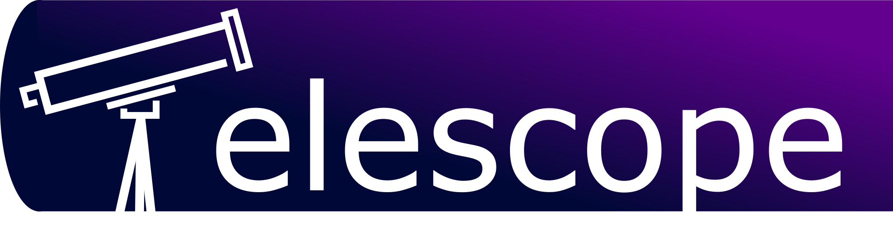

[](https://opensource.org/licenses/GPL-3.0/)

[](https://gitter.im/unix-telescope/Lobby)

Telescope is an open-source web applciation that tracks the progress of jobs submitted to remote servers using Sun Grid Engine (SGE) on-demand scheduling system. It allows remote scheduling of pre-defined pipelines, as well as re-schedule queued jobs. Moreover, output files are rendered in HTML in real time, allowing  the use of markdown and rich-text features. Telescope does not assume anything from the remote server, except for SSH connection. The connection is stablished using SSH key pairs that are stored after encrypted.

### For more information, screenshots and a live-demo, please [visit our wiki](https://github.com/QCB-Collaboratory/telescope/wiki).

If you are interested in learning more about Telescope, or if you want to join the team to contribute, [don't hesitate in contacting us](https://github.com/Mangul-Lab-USC/telescope#contact-bugs-and-suggestions). There are several ways to contribute! Also, visit the [Documentation](https://github.com/Mangul-Lab-USC/telescope/wiki/Documentation) portion of our Wiki for more descriptions of the software and details about the installation and running of Telescope.

This project started as an effort from the [Collaboratory](https://qcb.ucla.edu/collaboratory/), a unit within the Institute for Quantitative and Computational Biology (QCBio) at UCLA, and was developed during the [Winter Python Hackathon](https://github.com/QCB-Collaboratory/Python-Hackathon-Winter2018). It is currently maintained by the Mangul Lab at USC. 
We have also published the paper "Telescope: an interactive tool for managing large scale analysis from mobile devices", available at [arxiv](https://arxiv.org/abs/1909.12469).


## Quick start

There are very few steps necessary to get started with Telescope. For a step-by-step tutorial, [click here](https://github.com/Mangul-Lab-USC/telescope/blob/master/test/Readme.md) or [here](https://github.com/Mangul-Lab-USC/telescope/wiki/Documentation).

### Installation

The easiest way to install telescope is by using ```pip```:
```
pip install git+https://github.com/Mangul-Lab-USC/telescope
```

### Running

Once installed, you will need two files to run Telescope: (i) a configuration file that defines your user's credentials and server address, and (ii) a small python script that starts the server.

1) Create a new file called ```config.ini``` with the following content:
```
[CREDENTIALS]
USER   = <USERNAME>
SERVER = <SERVER ADDRESS>

[CONFIGURATION]
DATABASE= <DATABASE NAME>

[MONITOR]
NUMUSERS = 1
USER1 = <USERNAME>
```

The password field is not necessary if you use a ssh key to connect to the remote server (*highly* recommended). Make sure to keep this ```config.ini``` in your current directory, unless you'd like to customize the path as described in the Wiki.

2) Then, create another file called ```RunTelescope.py``` with the following content (note: there is a copy in the test directory of the Telescope repo):
```Python
import telescope

server = telescope.server()
server.run()
```

Finally, run this python script:
```
python RunTelescope.py
```
This should automatically open a web broswer with telescope running. More details about ```RunTelescope.py``` can be found in the [Documentation](https://github.com/Mangul-Lab-USC/telescope/wiki/Documentation) portion of the wiki.

If an error message appears, you may have found a bug -- we'd appreciate if you could report it. For more details, please visit our [wiki](https://github.com/Mangul-Lab-USC/telescope/wiki/Documentation).


## Contact, bugs and suggestions

If you find bugs and/or have suggestions for Telescope, please
* [Open an issue](https://github.com/Mangul-Lab-USC/telescope/issues) with a detailed description;

## Dependencies

Telescope can be self-hosted and track jobs from a list of users. It runs in Python 2.7\* or 3\*, with the following non-standard dependencies:

* [paramiko](http://www.paramiko.org)
* [pynacl](https://pynacl.readthedocs.io/en/stable/)
* [tornado](http://www.tornadoweb.org/en/stable/)
* [numpy](http://www.numpy.org)
* [configparser](https://docs.python.org/3/library/configparser.html)

These dependencies will automatically be installed if Telescope is installed using ```pip```.

## License

Telescope is shared under the [GNU General Public License v3.0](https://github.com/QCB-Collaboratory/telescope/blob/master/LICENSE), please take a moment to read it. Permissions of this copyleft license are conditioned on making available complete source code of licensed works and modifications, which include larger works using a licensed work, under the same license. Copyright and license notices must be preserved. Contributors provide an express grant of patent rights.

```
Telescope
Copyright (C) 2017-2019  QCB Collaboratory, et al
Copyright (C) 2019 Mangul Lab - USC, et al

This material is a free software: you can redistribute it and/or modify
it under the terms of the GNU General Public License as published by
the Free Software Foundation, either version 3 of the License, or
(at your option) any later version.

This program is distributed in the hope that it will be useful,
but WITHOUT ANY WARRANTY; without even the implied warranty of
MERCHANTABILITY or FITNESS FOR A PARTICULAR PURPOSE.  See the
GNU General Public License for more details.

You should have received a copy of the GNU General Public License
along with this program. If not, see <http://www.gnu.org/licenses/>.
```
